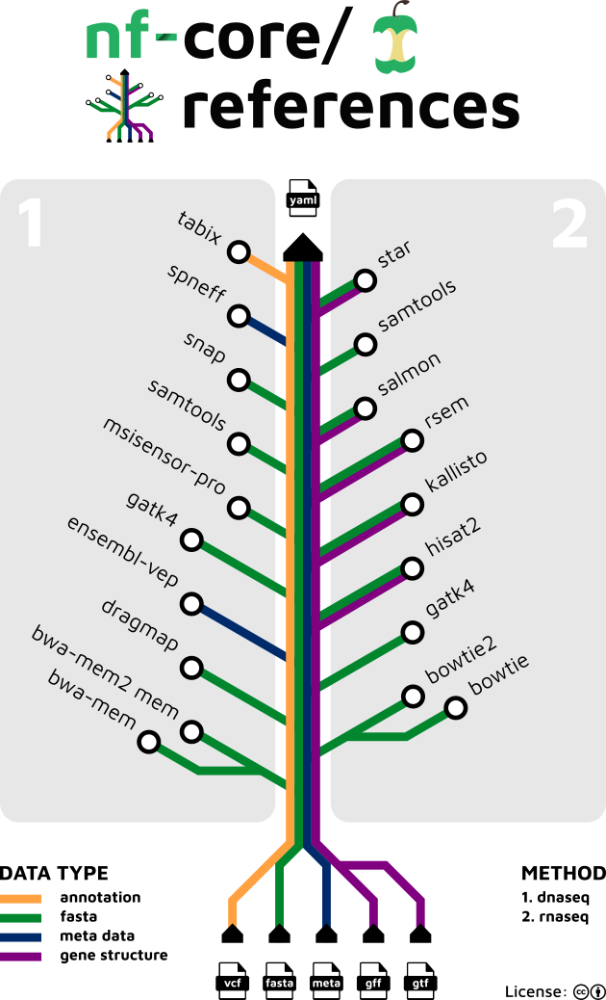

<h1>
  <picture>
    <source media="(prefers-color-scheme: dark)" srcset="docs/images/nf-core-references_logo_dark.png">
    
  </picture>
</h1>

[](https://github.com/codespaces/new/nf-core/references)
[](https://github.com/nf-core/references/actions/workflows/nf-test.yml)
[](https://github.com/nf-core/references/actions/workflows/linting.yml)[](https://nf-co.re/references/results)[](https://doi.org/10.5281/zenodo.14576225)
[](https://www.nf-test.com)

[](https://www.nextflow.io/)
[](https://github.com/nf-core/tools/releases/tag/4.0.3)
[](https://docs.conda.io/en/latest/)
[](https://www.docker.com/)
[](https://sylabs.io/docs/)
[](https://cloud.seqera.io/launch?pipeline=https://github.com/nf-core/references)

[](https://nfcore.slack.com/channels/references)[](https://bsky.app/profile/nf-co.re)[](https://mstdn.science/@nf_core)[](https://www.youtube.com/c/nf-core)

## Introduction

**nf-core/references** is a bioinformatics pipeline that build references.

For most common organisms references will be stored them in the cloud, similar to [AWS iGenomes](https://github.com/ewels/AWS-iGenomes/), to allow for fast and simple access and better reproducibility.
References can also be built locally for any organisms.



## DNASEQ

For DNASEQ pipelines (ie [nf-core/sarek](https://nf-co.re/sarek)), needing only a fasta file, it will be able to build the following references:

- [BWA-MEM](https://arxiv.org/abs/1303.3997v2) index
- [BWA-MEM2](https://ieeexplore.ieee.org/document/8820962) index
- [DragMap](https://github.com/Illumina/DRAGMAP) hashtable
- Fasta dictionary (with [GATK4](https://pubmed.ncbi.nlm.nih.gov/20644199/))
- Fasta fai (with [SAMtools](https://pubmed.ncbi.nlm.nih.gov/19505943/))
- Fasta intervals bed (with [GATK4](https://pubmed.ncbi.nlm.nih.gov/20644199/))
- [MSISensorPro](https://www.sciencedirect.com/science/article/pii/S1672022920300218) list
- [SNAP](https://www.biorxiv.org/content/10.1101/2021.11.23.469039v1/) index

It will compress VCF files, if it was not already compressed, and tabix index it.

- [Tabix](https://academic.oup.com/bioinformatics/article/27/5/718/262743)

And with metadata, it will be able to download annotation caches from:

- [EnsemblVEP](https://pubmed.ncbi.nlm.nih.gov/27268795/)
- [snpEff](https://pcingola.github.io/SnpEff/)

## RNASEQ

For RNASEQ pipelines (ie [nf-core/rnaseq](https://nf-co.re/rnaseq) or [nf-core/rnavar](https://nf-co.re/rnavar)), providing additional files describing genes' structures (either GFF3 or GTF), it will be able to build the following references:

- [Bowtie1](http://genomebiology.com/2009/10/3/R25) index
- [Bowtie2](https://www.nature.com/articles/nmeth.1923) index
- Fasta dictionary (with [GATK4](https://pubmed.ncbi.nlm.nih.gov/20644199/))
- Fasta sizes (with [SAMtools](https://pubmed.ncbi.nlm.nih.gov/19505943/))
- GTF (from GFF3 with [GffRead](https://pubmed.ncbi.nlm.nih.gov/32489650/))
- [HISAT2](https://pubmed.ncbi.nlm.nih.gov/31375807/) index
- [Kallisto](https://pachterlab.github.io/kallisto/) index
- [RSEM](https://pubmed.ncbi.nlm.nih.gov/21816040/) index
- [STAR](https://pubmed.ncbi.nlm.nih.gov/23104886/) index
- [Salmon](https://pubmed.ncbi.nlm.nih.gov/28263959/) index
- Splice sites (with [HISAT2](https://pubmed.ncbi.nlm.nih.gov/31375807/))
- Transcript fasta (with [RSEM](https://pubmed.ncbi.nlm.nih.gov/21816040/))

## Datasheets

Datasheets are stored in [references-datasheets](https://github.com/nf-core/references-datasheets).

## Running

> [!NOTE]
> If you are new to Nextflow and nf-core, please refer to [this page](https://nf-co.re/docs/get_started/environment_setup/overview) on how to set-up Nextflow. Make sure to [test your setup](https://nf-co.re/docs/get_started/run-your-first-pipeline) with `-profile test` before running the workflow on actual data.

`asset.yml`:

```yml
- genome: GRCh38_chr21
  fasta: "https://raw.githubusercontent.com/nf-core/test-datasets/references/references/GRCh38_chr21/GRCh38_chr21.fa"
  gtf: "https://raw.githubusercontent.com/nf-core/test-datasets/references/references/GRCh38_chr21/GRCh38_chr21.gtf"
  source_version: "CUSTOM"
  readme: "https://raw.githubusercontent.com/nf-core/test-datasets/references/references/GRCh38_chr21/README.md"
  source: "nf-core/references"
  source_vcf: "GATK_BUNDLE"
  species: "Homo_sapiens"
  vcf: "https://raw.githubusercontent.com/nf-core/test-datasets/modules/data/genomics/homo_sapiens/genome/vcf/dbsnp_146.hg38.vcf.gz"
```

Each line represents a source for building a reference, a reference already built, or metadata.

Now, you can run the pipeline using:

```bash
nextflow run nf-core/references \
   -profile <docker/singularity/.../institute> \
   --input datasheet.yml \
   --outdir <OUTDIR>
```

> [!WARNING]
> Please provide pipeline parameters via the CLI or Nextflow `-params-file` option. Custom config files including those provided by the `-c` Nextflow option can be used to provide any configuration _**except for parameters**_; see [docs](https://nf-co.re/docs/running/run-pipelines#using-parameter-files).

For more details and further functionality, please refer to the [usage documentation](https://nf-co.re/references/usage) and the [parameter documentation](https://nf-co.re/references/parameters).

## Pipeline output

To see the results of an example test run with a full size dataset refer to the [results](https://nf-co.re/references/results) tab on the nf-core website pipeline page.
For more details about the output files and reports, please refer to the
[output documentation](https://nf-co.re/references/output).

## Credits

nf-core/references was originally written by [Maxime U Garcia](https://github.com/maxulysse) | [Edmund Miller](https://github.com/edmundmiller) | [Phil Ewels](https://github.com/ewels).

We thank the following people for their extensive assistance in the development of this pipeline:

- [Adam Talbot](https://github.com/adamrtalbot)
- [Friederike Hanssen](https://github.com/FriederikeHanssen)
- [Harshil Patel](https://github.com/drpatelh)
- [James Fellows Yates](https://github.com/jfy133)
- [Jonathan Manning](https://github.com/pinin4fjords)
- [Nicolas Vannieuwkerke](https://github.com/nvnieuwk)

## Contributions and Support

If you would like to contribute to this pipeline, please see the [contributing guidelines](docs/CONTRIBUTING.md).

For further information or help, don't hesitate to get in touch on the [Slack `#references` channel](https://nfcore.slack.com/channels/references) (you can join with [this invite](https://nf-co.re/join/slack)).

## Citations

If you use nf-core/references for your analysis, please cite it using the following doi: [10.5281/zenodo.14576225](https://doi.org/10.5281/zenodo.14576225)

An extensive list of references for the tools used by the pipeline can be found in the [`CITATIONS.md`](CITATIONS.md) file.

You can cite the `nf-core` publication as follows:

> **The nf-core framework for community-curated bioinformatics pipelines.**
>
> Philip Ewels, Alexander Peltzer, Sven Fillinger, Harshil Patel, Johannes Alneberg, Andreas Wilm, Maxime Ulysse Garcia, Paolo Di Tommaso & Sven Nahnsen.
>
> _Nat Biotechnol._ 2020 Feb 13. doi: [10.1038/s41587-020-0439-x](https://dx.doi.org/10.1038/s41587-020-0439-x).
